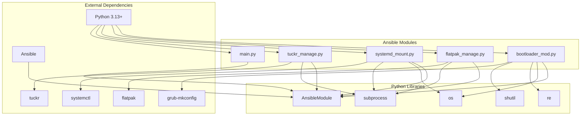

# Design Document: Ansible Custom Modules Library

## Overview

This document describes the functionality and architecture of the custom Ansible modules in this library. These modules provide specialized functionality for system configuration, package management, and service management tasks related to Linux systems, particularly those with systemd-based configurations and bootloader management.

## Module List

The library consists of the following modules:

1. `bootloader_mod.py` - Bootloader configuration management
2. `flatpak_manage.py` - Flatpak application management
3. `systemd_mount.py` - Systemd mount unit management
4. `tuckr_manage.py` - Tuckr-based dotfile management
5. `main.py` - Example/demonstration module

## Module Details

### 1. `bootloader_mod.py` - Bootloader Configuration Management

#### Purpose

This module manages kernel command-line parameters in various bootloader configurations, supporting systemd-boot, refind, and GRUB bootloaders.

#### Key Features

- **Bootloader Detection**: Automatically detects the installed bootloader (systemd-boot, refind, or GRUB)
- **Configuration Modification**: Adds or removes kernel parameters from bootloader configurations
- **Support for Multiple Bootloaders**: Handles different configuration formats for different bootloader types
- **Backup Creation**: Creates backup copies of configuration files before modification
- **Check Mode Support**: Supports Ansible's check mode for dry-run operations
- **Parameter Validation**: Validates that the system has a supported bootloader

#### Architecture

The module uses a strategy pattern to handle different bootloader types:

- **systemd-boot**: Modifies `options` lines in entry configuration files
- **refind**: Updates kernel parameters in refind entry descriptions
- **GRUB**: Modifies `GRUB_CMDLINE_LINUX` and `GRUB_CMDLINE_LINUX_DEFAULT` variables

#### Parameters

- `text_to_add`: String to add to kernel command line
- `text_to_remove`: String to remove from kernel command line
- `detect_only`: Only detect bootloader type without making changes
- `check_args`: Check if specific kernel arguments exist
- `bootloader`: Specify bootloader type ('auto', 'systemd-boot', 'refind', 'grub')
- `config_file`: Custom configuration file path

#### Return Values

- `changed`: Whether the configuration was modified
- `bootloader_type`: Detected or specified bootloader type
- `config_file`: Path to the configuration file
- `msg`: Status message

### 2. `flatpak_manage.py` - Flatpak Application Management

#### Purpose

This module manages the installation and removal of Flatpak applications, supporting both user and system-wide installations.

#### Key Features

- **Multi-scope Support**: Manages Flatpaks in both user and system scopes
- **Batch Management**: Can install/remove multiple applications in a single task
- **State Management**: Ensures applications are present or absent as specified
- **Extra Package Removal**: Optionally removes packages not in the desired list
- **Package Skipping**: Allows certain packages to be skipped during removal operations
- **Check Mode Support**: Simulates operations without making changes

#### Architecture

The module follows an idempotent design pattern:

1. Retrieves the list of currently installed Flatpaks
2. Compares with the desired list
3. Determines which packages to install/remove
4. Executes the necessary operations

#### Parameters

- `packages`: List of Flatpak application IDs to manage
- `scope`: Installation scope ('user' or 'system')
- `remote`: Flatpak remote repository (default: 'flathub')
- `state`: Desired state ('present' or 'absent')
- `remove_extra`: Remove packages not in the desired list
- `skip_packages`: List of packages to exclude from removal

#### Return Values

- `changed`: Whether any changes were made
- `added`: List of newly installed packages
- `removed`: List of uninstalled packages
- `kept`: List of existing packages that were kept
- `skipped`: List of packages that were skipped
- `message`: Summary of operations performed

### 3. `systemd_mount.py` - Systemd Mount Unit Management

#### Purpose

This module manages systemd mount and automount unit files, particularly for systems that need special handling like Bazzite OS (which uses `/var/mnt` instead of `/mnt`).

#### Key Features

- **Multi-file Type Support**: Handles .mount, .automount, and .swap unit files
- **OS-Specific Path Handling**: Supports different operating system configurations (Bazzite, Arch, CachyOS)
- **Device Validation**: Checks if mount devices exist before enabling units
- **Unit Management**: Manages enabling and starting of systemd units
- **Backup and Restoration**: Removes existing mount units before applying new ones
- **Single and Bulk Operations**: Supports processing individual units or all units in a directory

#### Architecture

The module uses different processing paths based on the operation mode:

- `all`: Processes all mount/automount/swap files in a source directory
- `single_mount`: Processes a specific mount file
- `single_swap`: Processes a specific swap file

For Bazzite systems, the module transforms paths from `/mnt/` to `/var/mnt/` in unit files.

#### Parameters

- `src`: Source directory for bulk operations
- `src_dir`: Source directory for single file operations
- `mount_file`: Specific mount file to process
- `swap_file`: Specific swap file to process
- `dst`: Destination directory (default: `/etc/systemd/system`)
- `os_type`: Target operating system type
- `state`: Desired state ('present' or 'absent')
- `mode`: Operation mode ('all', 'single_mount', 'single_swap')

#### Return Values

- `changed`: Whether any changes were made
- `units_installed`: List of unit files installed
- `msg`: Status message

### 4. `tuckr_manage.py` - Tuckr Dotfile Management

#### Purpose

This module manages dotfile configurations using the Tuckr tool, which appears to be a dotfile management system similar to stow or GNU's dotfiles.

#### Key Features

- **Idempotent Operations**: Ensures dotfiles are properly managed without duplication
- **Conflict Resolution**: Handles file conflicts when installing dotfiles
- **Backup Support**: Creates backups of conflicting files before overwriting
- **Force Operations**: Supports forced installation that overwrites existing files
- **Tuckr Integration**: Directly interfaces with the Tuckr command-line tool

#### Architecture

The module wraps Tuckr CLI commands with Ansible integration:

- For `state=present`: Uses `tuckr add` to install dotfiles
- For `state=absent`: Uses `tuckr rm` to remove dotfiles
- Implements conflict detection and resolution logic
- Provides backup functionality before forced operations

#### Parameters

- `name`: Name of the tuckr package/dotfile set to manage
- `state`: Desired state ('present' or 'absent')
- `force`: Whether to force installation (overwrite conflicting files)
- `backup`: Whether to backup conflicting files before force operations

#### Return Values

- `changed`: Whether any changes were made
- `conflicts`: List of files that would conflict during installation
- `stdout`/`stderr`: Output from tuckr commands
- `rc`: Return code from tuckr commands

### 5. `main.py` - Example Module

#### Purpose

This serves as a simple demonstration module with a basic "Hello World" implementation. It likely serves as a template for new module development.

## Common Design Patterns

### Error Handling

All modules follow Ansible's error handling pattern:

- Use `module.fail_json()` for unrecoverable errors
- Use `module.warn()` for non-critical issues
- Provide descriptive error messages

### Idempotency

All modules are designed to be idempotent, meaning they can be run multiple times without causing unintended side effects:

- Check current state before making changes
- Only apply changes when necessary
- Support check mode for dry-run operations

### Configuration Management

Modules follow best practices for configuration management:

- Create backups before modifying files
- Validate inputs before applying changes
- Support custom configuration file paths

## Dependencies and Requirements

All modules require:

- Ansible's basic module utilities (`ansible.module_utils.basic`)
- Python 3.13+ (as specified in pyproject.toml)
- System-specific tools (flatpak, systemctl, tuckr, etc.)

## Testing and Validation

The modules now have comprehensive test coverage with improved quality and structure:

- **Test Infrastructure**: Complete pytest-based test suite with `conftest.py` containing shared fixtures
- **Unit Tests**: Individual test functions for all major functions and methods in each module
- **Integration Tests**: Tests validating module interactions and overall functionality
- **Mocking**: Extensive use of pytest-mock's `mocker` fixture for mocking to ensure consistent test patterns and avoid external dependencies during testing
- **Bug Fixes**: Two critical regex bugs were identified and fixed during testing:
  - `modify_refind_config()` now properly handles quoted strings for parameter removal
  - `modify_grub_config()` now properly adds parameters to existing GRUB configuration lines
- **Test Coverage**: 80+ tests covering all modules with both positive and error cases, achieving >85% overall coverage
- **Test Quality Improvements**: Streamlined and parametrized existing tests to reduce redundancy and improve maintainability

### Test Organization

The test suite is organized as follows:

- `tests/conftest.py`: Shared fixtures including mocked AnsibleModule, temporary files/directories, and common test utilities
- `tests/test_bootloader_mod.py`: Complete test suite for bootloader module, including integration tests and 88.39% coverage
- `tests/test_flatpak_manage.py`: Complete test suite for flatpak module, including integration tests - **Updated to use pytest-mock's `mocker` fixture instead of unittest.mock decorators**
- `tests/test_systemd_mount.py`: Complete test suite for systemd mount module, including integration tests
- `tests/test_tuckr_manage.py`: Complete test suite for tuckr module, including integration tests

### Test Patterns

The test suite follows consistent modern pytest patterns:

- Uses `mocker` fixture for all mocking needs instead of `@patch` decorators
- Maintains idempotent test design to ensure reliable test execution
- Includes parameterized tests for comprehensive coverage of different scenarios
- Employs proper exception testing to validate error handling paths
- Leverages shared fixtures to reduce code duplication and improve maintainability
- Implements proper Ansible module mocking patterns to simulate real execution paths

## Module Dependency Graph

## Security Considerations

- File operations are validated to prevent path traversal
- Backup files are created with appropriate permissions
- System-level operations require appropriate privileges
- All external commands are run through Ansible's safe execution methods
